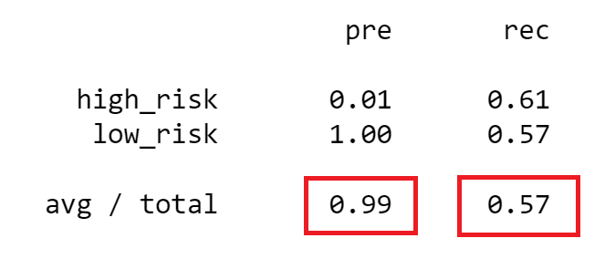

# Credit Risk Analysis

## Overview of the analysis: 
The purpose of this analysis is to assess credit card risk from a credit card credit dataset from LendingClub (a peer-to-peer lending services company). Credit card risk is an unbalanced classification problem due to the fact that good loans significantly outnumber risky loans. Therefore, a variety of different techniques were used to train and evaluate models with unbalanced classes. The imbalanced-learn and scikit-learn libraries were used to build and evaluate models using resampling. 

RandomOverSampler and SMOTE algorithms were used to oversample the data, and the ClusterCentroids algorithm was used to undersample the data. A combinational approach of over- and undersampling was used, using the SMOTEEN algorithm. Furthermore, two machine learning models that reduce bias, BalancedRandomForestClassifier and EasyEnsembleClassifier, were used. The outcome of these models were compared to evaluate performance and recommend whether they should be used to predict credit risk.

## Results: 
* Naive Random Oversampling: 
    - Balanced Accuracy Score: 62.49%

    - Precision Score: 99%, Recall Score: 65%

* SMOTE Oversampling:
    - Balanced Accuracy Score: 65.13%

    - Precision Score: 99%, Recall Score: 66%

* Cluster Centroids:
    - Balanced Accuracy Score: 59.03%

    - Precision Score: 99%, Recall Score: 57%

* SMOTEENN:
    - Balanced Accuracy Score: 51.59%

    - Precision Score: 99%, Recall Score: 44%

* Balanced Random Forest Classifier:
    - Balanced Accuracy Score: 78.78%

    - Precision Score: 99%, Recall Score: 91%

* Easy Ensemble AdaBoost Classifier:
    - Balanced Accuracy Score: 92.54%

    - Precision Score: 99%, Recall Score: 94%

## Summary: 
The oversampling (Naive Random and SMOTE), undersampling (ClusterCentroids), and combinational approach (SMOTEEN) all had inadequate balanced accuracy scores (less than 70%). Although they had high precision scores, they also had low recall scores. I would not recommend any of these techniques for credit risk analysis.

The Balanced Random Forest Classifier and Easy Ensemble AdaBoost Classifier had much better accuracy and recall scores. The Easy Ensemble AdaBoost Classifier had the best accuracy and recall scores of all the risk assessment techniques and would by recommendation for future credit risk analyses.
